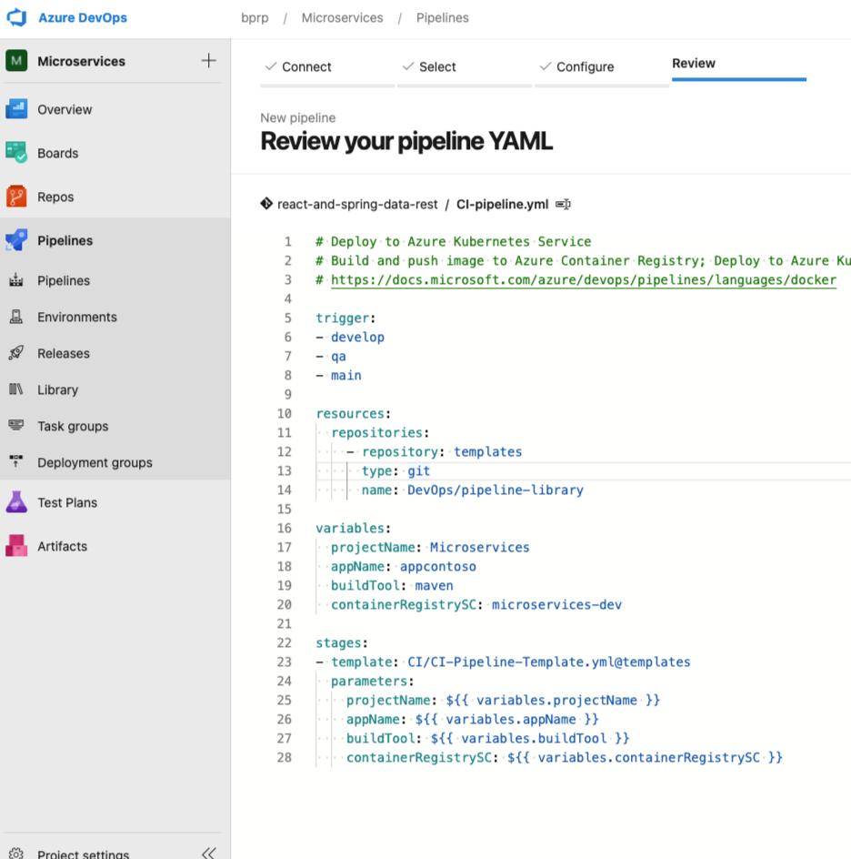
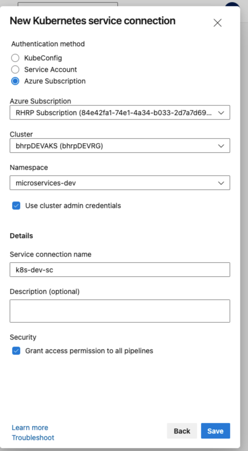

Cloud DevOps
============

## Index
1. Overview 
    - 1.0 Prerequisites
    - 1.1 High Level - Business Architecture
2. Azure DevOps
    - 2.0 What is
    - 2.1 Set up your organization
        - 2.1.0 Set up your DevOps project
3. Infrastructure as Code
    - 3.0 What is
    - 3.1 Terraform
    - 3.2 Prerequisites
        - 3.2.1 Installation
        - 3.2.2 Create Manual Resources 
     - 3.3 IaC generic template
     - 3.4 Implementing IaC 
        - 3.4.0 Create and set up IaC project 
        - 3.4.1 Set up your Azure Pipelines
        - 3.4.2 Implement Azure Pipeline Deploy
        - 3.4.3 Implement Azure Pipeline Destroy
4. Continuous Integration and Continuous Delivery
    - 4.0 What is
    - 4.1 Create and set up Microservices project
    - 4.2 Continuous Integration
        - 4.2.0 Set up your Azure Pipelines
        - 4.2.1 CI generic template
        - 4.2.2 Implementing CI  
    - 4.3 Continuous Delivery
        - 4.3.0 Set up your Azure Pipelines
        - 4.3.1 CD generic template
        - 4.3.2 Implementing CD   
6. References


### 1. Overview 
In this repository you will find generic templates to implement Infrastrcure as Code, Continuous Integration, and Continuous Delivery. These templates are made to work with Azure Pipelines  

#### 1.0 Prerequisites

- Azure Account
- Basic knowledge of Infrastrcure as Code, Continuous Integration, and Continuous Delivery.
- Experience with Terraform

#### 1.1 High Level - Business Architecture


##### Azure DevOps

###### Azure Repos

###### 1. pipeline-library
Contains all the generic pipeline for:
- IaC with Terraform and Azure
- CI for java componentes with maven and gradle
- CD for deploy images from Azure Container Registry to Azure Kubernetes Service

###### 2. iac-demo
This repository contains the instrastructure definition on Azure for this demo. It have a simple yaml that implements the generic yaml from pipelile-library

###### 3. react-and-spring-data-rest
Sample java project with spring boot and react js. It have a two yamls that implement the generic CI yaml and CD yaml from pipelile-library


### 2. Azure DevOps

#### 2.0 What is 
Azure DevOps Server <sub><sup>[5]</sup></sub> is a Microsoft product that provides version control, reporting, requirements management, project management, automated builds, testing and release management capabilities. It covers the entire application lifecycle, and enables DevOps capabilities

#### 2.1 Set up your organization

- Search DevOps in your Azure Home 


- Click on 'Azure DevOps organizations'


- Select 'My Azure DevOps Organizations', then 'Create new organization'


- Fill the values for your organization, and 'Continue'


- Finally, create a project call 'DevOps'


#### 2.1.0 Set up your DevOps project
Azure Repos <sub><sup>[6]</sup></sub> is a set of version control tools that you can use to manage your code. Whether your software project is large or small, using version control as soon as possible is a good idea.

- Go to your Azure DevOps organization https://dev.azure.com/bprp/

- Select 'DevOps' project


- Select 'Repos' option


- Create a new repository called 'pipeline-library'


- Upload the content of the folder pipeline-library in this repository


### 3. Infrastructure as Code

#### 3.0 What is 
Infrastructure as code is the process of managing and provisioning computer data centers through machine-readable definition files, rather than physical hardware configuration or interactive configuration tools.

#### 3.1 Terraform 
Hashicorp Terraform <sub><sup>[1]</sup></sub> is an open-source tool for provisioning and managing cloud infrastructure. It codifies infrastructure in configuration files that describe the topology of cloud resources. These resources include virtual machines, storage accounts, and networking interfaces. The Terraform CLI provides a simple mechanism to deploy and version the configuration files to Azure .

#### 3.2 Prerequisites
In order to use Terraform in your Azure DevOps organization, you will need to do some tasks before.

#### 3.2.1 Installation

To improve Terraform integration with Azure Pipelines, it's necessary yo install the Terraform extension in you Azure DevOps organization

- Go to Visual Studio Marketplace <sub><sup>[3]</sup></sub>

- Search 'Terraform' extension by Microsoft DevLabs


- Select 'Get it free'

- Then, select your Azure DevOps organization


- Click on 'Install', then 'Proceed to organization'

#### 3.2.2 Create Manual Resources

Create some resources in your Azure account:

-  Resource group 
```console
az group create -l centralus -n devopsRG
```

- Azure Storage Account
```console
az storage account create --resource-group devopsRG --name terraformrpasa --sku Standard_LRS --encryption-service blob
```

- Azure Storage Container
First, get the string connections of the storage account created before
```console
az storage account keys list --resource-group devopsRG --account-name terraformrpasa
```

Create the container using the value of {key1}
```console
az storage container create --name terraformrpasa --account-name terraformrpasa --account-key {key1}
```

#### 3.3 IaC generic template

IaC-Pipeline-Template.yaml is a generic template that can be used to desploy and destroy all kind of resource on Azure Cloud and Terraform. 
```console
parameters:
- name : 'enviromentParam'
  default: ''
  type: string
- name : 'enviromentAbrevParam'
  default: ''
  type: string
- name: terraformVersion
  default: ''
  type: string
- name: resourceGroup
  default: ''
  type: string
- name: storageAccount
  default: ''
  type: string
- name: containerName
  default: ''
  type: string
- name: key
  default: ''
  type: string
- name: serviceConnection
  default: ''
  type: string
- name: pipelineEnvironment
  default: ''
  type: string
- name : 'terraformAction'
  default: 'deploy'
  type: string
  values:
    - deploy
    - destroy

stages:
  - stage: validate
    jobs:
      - job: validate 
        continueOnError: false
        steps:
          - task: TerraformInstaller@0
            displayName: 'install'
            inputs:
              terraformVersion: ${{ parameters.terraformVersion }}
          - task: TerraformTaskV2@2
            displayName: init
            inputs:
              provider: 'azurerm'
              command: 'init'
              backendServiceArm: ${{ parameters.serviceConnection }}
              backendAzureRmResourceGroupName: ${{ parameters.resourceGroup }}
              backendAzureRmStorageAccountName: ${{ parameters.storageAccount }}
              backendAzureRmContainerName: ${{ parameters.containerName }}
              backendAzureRmKey: ${{ parameters.key }}
          - task: TerraformTaskV2@2
            displayName: validate
            inputs:
              provider: 'azurerm'
              command: 'validate'
  - stage: deploy
    jobs:
      - deployment: deploy_terraform
        continueOnError: false
        condition: eq('${{ parameters.terraformAction }}', 'deploy')
        environment: ${{ parameters.pipelineEnvironment }}
        strategy:
          runOnce:
            deploy:
              steps:
                - checkout: self
                - task: TerraformInstaller@0
                  displayName: 'install'
                  inputs:
                    terraformVersion: ${{ parameters.terraformVersion }}
                - task: TerraformTaskV2@2
                  displayName: 'init'
                  inputs:
                    provider: 'azurerm'
                    command: 'init'
                    backendServiceArm: ${{ parameters.serviceConnection }}
                    backendAzureRmResourceGroupName: ${{ parameters.resourceGroup }}
                    backendAzureRmStorageAccountName: ${{ parameters.storageAccount }}
                    backendAzureRmContainerName: ${{ parameters.containerName }}
                    backendAzureRmKey: ${{ parameters.key }}
                - task: TerraformTaskV2@2
                  displayName: 'plan'
                  inputs:
                    provider: 'azurerm'
                    command: 'plan'
                    environmentServiceNameAzureRM: ${{ parameters.serviceConnection }}
                    commandOptions: -input=false -var "environment=${{ parameters.enviromentParam }}" -var "environment_abrev=${{ parameters.enviromentAbrevParam }}"
                - task: TerraformTaskV2@2
                  displayName: 'apply'
                  inputs:
                    provider: 'azurerm'
                    command: 'apply'
                    environmentServiceNameAzureRM: ${{ parameters.serviceConnection }}
                    commandOptions: -input=false -var "environment=${{ parameters.enviromentParam }}" -var "environment_abrev=${{ parameters.enviromentAbrevParam }}"
  - stage: destroy
    jobs:
      - deployment: destoy_terraform
        continueOnError: false
        condition: eq('${{ parameters.terraformAction }}', 'destroy')
        environment: ${{ parameters.pipelineEnvironment }}
        strategy:
          runOnce:
            deploy:
              steps:
                - checkout: self
                - task: TerraformInstaller@0
                  displayName: 'install'
                  inputs:
                    terraformVersion: ${{ parameters.terraformVersion }}
                - task: TerraformTaskV2@2
                  displayName: 'init'
                  inputs:
                    provider: 'azurerm'
                    command: 'init'
                    backendServiceArm: ${{ parameters.serviceConnection }}
                    backendAzureRmResourceGroupName: ${{ parameters.resourceGroup }}
                    backendAzureRmStorageAccountName: ${{ parameters.storageAccount }}
                    backendAzureRmContainerName: ${{ parameters.containerName }}
                    backendAzureRmKey: ${{ parameters.key }}
                - task: TerraformTaskV2@2
                  displayName: 'destroy'
                  inputs:
                    provider: 'azurerm'
                    command: 'destroy'
                    environmentServiceNameAzureRM: ${{ parameters.serviceConnection }}
                    commandOptions: -input=false -var "environment=${{ parameters.enviromentParam }}" -var "environment_abrev=${{ parameters.enviromentAbrevParam }}"

```
#### 3.4 Implementing IaC

#### 3.4.0 Create and set up IaC project  

- Go to your Azure DevOps organization https://dev.azure.com/bprp/

- Click 'New project' 


- Complete 'Project name' with IaC, and 'create'


- Select 'Repos' option


- Create a new repository called 'iac-demo'


- Upload the content of the folder iac-demo in this repository


#### 3.4.1 Set up your pipelines 

##### 3.4.1.0 Service Connections for Azure Pipelines
You can create a connection<sub><sup>[6]</sup></sub> from Azure Pipelines to external and remote services for executing tasks in a job. Once you establish a connection, you can view, edit, and add security to the service connection.

######Azure Resource Manager service connection 
- Go to your 'Project Settings'


- Under 'Pipeline' section, select 'Service Connections', then 'Create service connection'


- Check 'Service Principal (automatic)' in Authentication Method, and 'Next'


- Complete the service connection name with 'terraformfull-sc'


#### 3.4.2 Implement Azure Pipeline Desploy

- Go to IaC project https://dev.azure.com/bprp/IaC, then select 'Pipelines' 


- Click on 'Create Pipeline'

- Select your code repository, then select 'iac-demo' 


- Configure your pipeline using 'Existing Azure Pipeline YAML file'


- Select your yaml implementation


- Review your pipeline implementation, then click on 'Run'


- Wait results, and validate!


#### 3.4.3 Implement Azure Pipeline Destroy

- Go to IaC project https://dev.azure.com/bprp/IaC, then select 'Pipelines' 


- Click on 'Create Pipeline'

- Select your code repository, then select 'iac-demo' 


- Configure your pipeline using 'Existing Azure Pipeline YAML file'


- Select your yaml implementation 'BHRP-terraform-destroy.yaml'


- Review your pipeline implementation, then click on 'Run'


- Wait results, and validate!


### 4. Continuous Integration and Continuous Delivery

#### 4.0 What is 
Continuous integration/continuous delivery<sub><sup> [8]</sup></sub>, known as CI/CD, is a set of processes that help software development teams deliver code changes more frequently and reliably. CI/CD is part of DevOps, which helps shorten the software development lifecycle.

#### 4.1 Create and set up Microservices project

- Go to your Azure DevOps organization https://dev.azure.com/bprp/

- Click 'New project' 


- Complete 'Project name' with "Microservices", and 'create'


- Select 'Repos' option


- Create a new repository called 'react-and-spring-data-rest'


- Upload the content of the folder react-and-spring-data-rest in this repository


- Create 'develop' and 'qa' branches


#### 4.2 Continuous Integration

#### 4.2.0 Set up your Azure Pipelines

- Go to your 'Project Settings'


- Under 'Pipeline' section, select 'Service Connections', then 'Create service connection'


- Check 'Azure Container Registry', select your Container Registry give a name to the service connection (microservices-dev)


- Finally, save your service connection

#### 4.2.1 CI generic template

[CI-Pipeline-Template.yaml] This is a general template for Continuous Integration. It works for java componentes that uses maven or gradle. 

```console
parameters:
  - name : 'projectName'
    default: ''
    type: string
  - name : 'appName'
    default: ''
    type: string
  - name : 'containerRegistrySC'
    default: ''
    type: string
  - name : 'buildTool'
    default: ''
    type: string
    values:
      - maven
      - gradle

stages:
  - stage: parameters
    displayName: Build Stage
    jobs:
      - job: get_parameters
        displayName: Get Parameters
        steps:
          - script: echo "PROJECT_NAME= ${{ parameters.projectName }}"
          - script: echo "APP_NAME= ${{ parameters.appName }}"
          - script: echo "BUILD_TOOL= ${{ parameters.buildTool }}"
          - script: echo "CONTAINER_REGISTRY= ${{ parameters.containerRegistrySC }}"
          - script: java -version
  - stage: build_gradle
    displayName: Build Stage Gradle
    jobs:
      - job: build_job_gradle
        displayName: Build Gradle Job
        condition: eq('${{ parameters.buildTool }}', 'gradle')
        steps:
          - task: Gradle@2
            displayName: Compile Project
            inputs:
              gradleWrapperFile: 'gradlew'
              javaHomeOption: 'JDKVersion'
              jdkVersionOption: '1.8'
              jdkArchitectureOption: 'x64'
              tasks: 'compileJava compileTestJava'
          - task: Gradle@2
            displayName: Unit Tests
            inputs:
              gradleWrapperFile: 'gradlew'
              javaHomeOption: 'JDKVersion'
              jdkVersionOption: '1.8'
              jdkArchitectureOption: 'x64'
              publishJUnitResults: yes
              testResultsFiles: '**/TEST-*.xml'
              tasks: 'test'
          - task: Gradle@2
            displayName: Build Artifact
            inputs:
              gradleWrapperFile: 'gradlew'
              javaHomeOption: 'JDKVersion'
              jdkVersionOption: '1.8'
              jdkArchitectureOption: 'x64'
              tasks: 'assemble'
          - task: Docker@2
            displayName: Build and Push Docker Image
            inputs:
              command: buildAndPush
              repository: ${{ parameters.appName }}
              dockerfile: '**/Dockerfile'
              containerRegistry: ${{ parameters.containerRegistrySC }}
              tags: |
                $(Build.BuildId)
          - upload: manifests
            artifact: manifests
  - stage: build_maven
    displayName: Build Stage Maven
    jobs:
      - job: AppValues
        steps:
          - task: Bash@3
            inputs:
              targetType: 'inline'
              script: |
                pomVersion=`mvn -q -Dexec.executable=echo -Dexec.args='${project.version}' --non-recursive exec:exec`
                echo "##vso[task.setvariable variable=projectVersion;isOutput=true]$pomVersion"
            name: MVNValues
            displayName: Maven project parameters
      - job: build_job_maven
        dependsOn: AppValues
        displayName: Build Maven Job
        condition: eq('${{ parameters.buildTool }}', 'maven')
        variables:
          projectVersion: $[ dependencies.AppValues.outputs['MVNValues.projectVersion'] ]
        steps:
          - task: Maven@3
            displayName: Compile Project
            inputs:
              mavenPomFile: 'pom.xml'
              javaHomeOption: 'JDKVersion'
              jdkVersionOption: '1.8'
              jdkArchitectureOption: 'x64'
              goals: 'compile test-compile'
          - task: Maven@3
            displayName: Unit Tests
            inputs:
              mavenPomFile: 'pom.xml'
              javaHomeOption: 'JDKVersion'
              jdkVersionOption: '1.8'
              jdkArchitectureOption: 'x64'
              publishJUnitResults: yes
              testResultsFiles: '**/surefire-reports/TEST-*.xml'
              goals: 'test'

          - task: Maven@3
            displayName: Build Artifact
            inputs:
              mavenPomFile: 'pom.xml'
              javaHomeOption: 'JDKVersion'
              jdkVersionOption: '1.8'
              jdkArchitectureOption: 'x64'
              goals: 'package'

          - task: Maven@3
            displayName: Publish Artifact
            inputs:
              mavenPomFile: 'pom.xml'
              javaHomeOption: 'JDKVersion'
              jdkVersionOption: '1.8'
              jdkArchitectureOption: 'x64'
              goals: 'install'

          - task: Docker@2
            displayName: Build and Push Docker Image
            inputs:
              command: buildAndPush
              repository: ${{ parameters.appName }}
              dockerfile: '**/Dockerfile'
              containerRegistry: ${{ parameters.containerRegistrySC }}
              tags: $(Build.SourceBranchName)-$(projectVersion)
```

#### 4.2.2 Implementing CI

- Go to Microservices project https://dev.azure.com/bprp/Microservices, then select 'Pipelines' 


- Click on 'Create Pipeline'

- Select your code repository, then select 'react-and-spring-data-rest' 


- Configure your pipeline using 'Existing Azure Pipeline YAML file'


- Select your yaml implementation 'CI-pipeline.yaml' from your 'develop' branch


- Review your pipeline implementation, then click on 'Run'


- Wait results


- Validate


#### 4.3 Continuous Delivery 

#### 4.3.0 Set up your Azure Pipelines

- Go to your 'Project Settings'


- Under 'Pipeline' section, select 'Service Connections', then 'Create service connection'


- Check 'Azure Subscription', select your AKS cluster, and give a name to the service connection (k8s-dev-sc)


- Finally, save your service connection

#### 4.3.1 CD generic template

[CD-Pipeline-Template.yaml] This is a general template for Continuous Delivery. It will deploy an existent Azure container registry image to Azure kubernetes service. 

```console

parameters:
  - name : 'projectName'
    default: ''
    type: string
  - name : 'appName'
    default: ''
    type: string
  - name : 'containerRegistrySC'
    default: ''
    type: string
  - name : 'kubernetesSC'
    default: ''
    type: string
  - name: 'pipelineEnvironment'
    default: ''
    type: string
  - name: 'containerRegistry'
    default: ''
    type: string

stages:
  - stage: deploy_stage
    displayName: Deploy Stage
    jobs:
      - job: AppValues
        steps:
          - task: Bash@3
            inputs:
              targetType: 'inline'
              script: |
                pomVersion=`mvn -q -Dexec.executable=echo -Dexec.args='${project.version}' --non-recursive exec:exec`
                echo "##vso[task.setvariable variable=projectVersion;isOutput=true]$pomVersion"
            name: MVNValues
            displayName: Maven project parameters
      - deployment: deploy_job_manifest
        dependsOn: AppValues
        displayName: Deploy Job - Kubernetes
        variables:
          projectVersion: $[ dependencies.AppValues.outputs['MVNValues.projectVersion'] ]
        environment: ${{ parameters.pipelineEnvironment }}
        strategy:
          runOnce:
            deploy:
              steps:
                - checkout: self
                - task: KubernetesManifest@0
                  displayName: Create imagePullSecret
                  inputs:
                    action: createSecret
                    secretName: ${{ parameters.appName }}
                    dockerRegistryEndpoint: ${{ parameters.containerRegistrySC }}
                - task: KubernetesManifest@0
                  displayName: Deploy to Kubernetes cluster
                  inputs:
                    action: deploy
                    kubernetesServiceConnection: ${{ parameters.kubernetesSC }}
                    manifests: |
                      manifests/deployment.yml
                      manifests/service.yml
                    imagePullSecrets: ${{ parameters.appName }}
                    containers: |
                      ${{ parameters.containerRegistry }}/${{ parameters.appName }}:$(Build.SourceBranchName)-$(projectVersion)
```

#### 4.3.2 Implementing CD

- Go to Microservices project https://dev.azure.com/bprp/Microservices, then select 'Pipelines' 


- Click on 'Create Pipeline'

- Select your code repository, then select 'react-and-spring-data-rest' 


- Configure your pipeline using 'Existing Azure Pipeline YAML file'


- Select your yaml implementation 'CD-pipeline.yaml' from your 'develop' branch


- Review your pipeline implementation, then click on 'Run'


        If you get error, go to section: 5. Tips --> 5.1 Enviroment error

- Wait results


- Validate


### 5. Tips

#### 5.1 CD - Enviroment error 

There is a posibility that you can get an error if the enviroment you are trying to use doesn't exist.


- Under Pipelines, select Environments. Then 'New environment'

- Complete the form, and click 'Next'


- Select your cluster, and namespace you will deploy your component. Then 'Validate and create'


- Set up security


- Select 'Security'. Then add your pipeline


- Go back to your pipeline

### 6. References
<sub><sup>[1]</sup></sub> Terraform https://www.terraform.io/

<sub><sup>[2]</sup></sub> Terraform with Azure https://docs.microsoft.com/en-us/azure/developer/terraform/overview

<sub><sup>[3]</sup></sub> Extensions for Azure DevOps https://marketplace.visualstudio.com/azuredevops

<sub><sup>[4]</sup></sub> Terraform by Microsoft DevLabs https://marketplace.visualstudio.com/items?itemName=ms-devlabs.custom-terraform-tasks

<sub><sup>[5]</sup></sub> Azure DevOps https://azure.microsoft.com/en-us/services/devops/

<sub><sup>[6]</sup></sub> Azure DevOps Repos https://docs.microsoft.com/en-us/azure/devops/repos/?view=azure-devops

<sub><sup>[6]</sup></sub> Azure DevOps Service Connection https://docs.microsoft.com/en-us/azure/devops/pipelines/library/service-endpoints?view=azure-devops&tabs=yaml

<sub><sup>[7]</sup></sub> Pipeline as code https://about.gitlab.com/topics/ci-cd/pipeline-as-code/

<sub><sup>[8]</sup></sub> What Is CI/CD https://www.cisco.com/c/en/us/solutions/data-center/data-center-networking/what-is-ci-cd.html